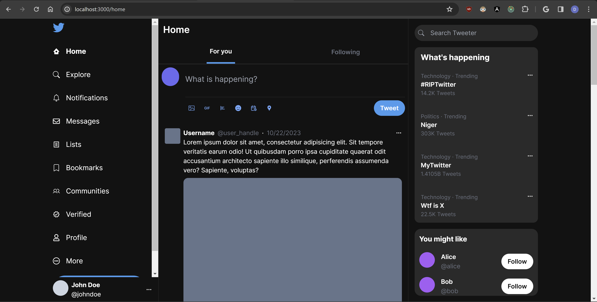
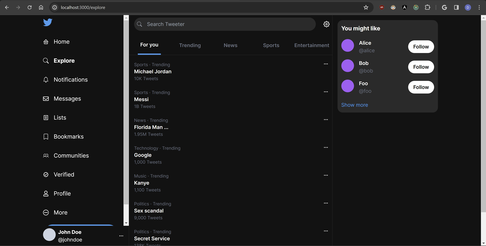
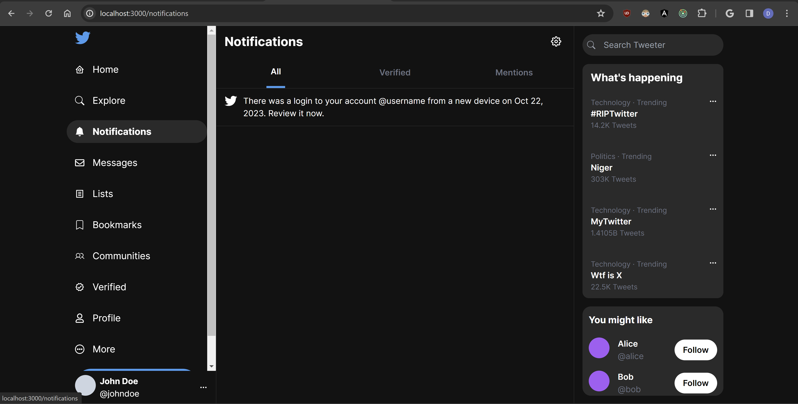
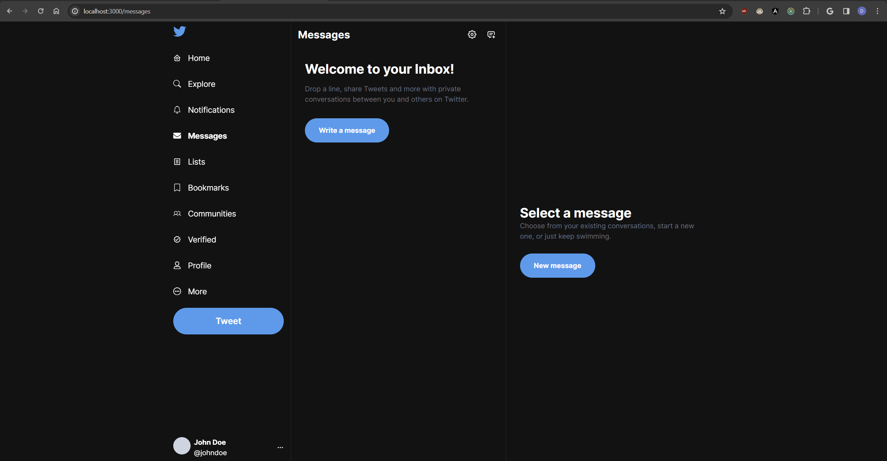

# Tweeter - The Twitter Clone

As the title suggests, this is a Twitter clone built with Next.js 13 using React Server Component (RSC). This is for demonstration purposes *only*.

## Images

### Home Page



### Explore Page



### Notifcations Page



### Messages Page



## Getting Started

If you're running this for the first time, make sure to install the dependencies first:

```bash
npm install
```

Run the development server:

```bash
npm run dev
# or
yarn dev
# or
pnpm dev
```

Open [http://localhost:3000](http://localhost:3000) with your browser to see the result.

## Learn More

To learn more about Next.js, take a look at the following resources:

- [Next.js Documentation](https://nextjs.org/docs) - learn about Next.js features and API.
- [Learn Next.js](https://nextjs.org/learn) - an interactive Next.js tutorial.

You can check out [the Next.js GitHub repository](https://github.com/vercel/next.js/) - your feedback and contributions are welcome!

## Deploy on Vercel

The easiest way to deploy your Next.js app is to use the [Vercel Platform](https://vercel.com/new?utm_medium=default-template&filter=next.js&utm_source=create-next-app&utm_campaign=create-next-app-readme) from the creators of Next.js.

Check out our [Next.js deployment documentation](https://nextjs.org/docs/deployment) for more details.

# Authentication and Authorization

[Supabase Auth with the Next.js App Router](https://supabase.com/docs/guides/auth/auth-helpers/nextjs)